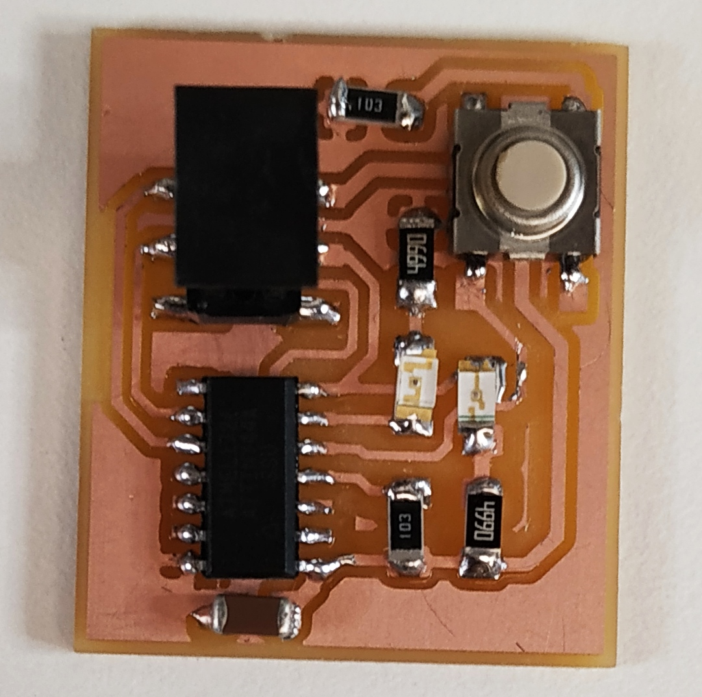

# My first Circuit Board
## Prerequisites:

**KiCad**

**Roland Mill SR20**

**Inkscape**

**PCB Boards and required electronics components** 

For creating a Circuit board we should a have PCB Board which need to be printed. We can create our circuit board through **KiCad** software. The process will start with the designing of the electronic circuit and creating its PCB diagram by using the Kicad software and then sending it for milling. Then, components needs to be added by means of soldering and finally programming the Microcontroller followed by testing.

The first step is to create a schematic design of the circuit for fabrication using a pcb design software known as **KICAD**,

**1. Create a Schematic Diagram**

Open *New project* in **Kicad**.

Place all the required components using *Place Component Tool* and by choosing components from the *Dropdown List.*

***Shortcut Commands for working in KiCad Application:-***

***Move component-***  place cursor over component and press G.

***Rotate component-*** place cursor over component and press R.

***Duplicate component-*** place cursor over component and press C.

***Delete component-*** place cursor over component and press Del.

Connecting components using ***Green wire*** icon (tools on rt. hand).

Remember to add a ***PWR_FLAG*** to ***VCC*** and ***GND***.

Also remember to assign a ***"No Connect"*** symbol for any unused pin of Microcontroller if any.

**2. Naming Conventions**

Use ***"Annotate schematic symbols"*** tool (choose default values).

**3. Changing the value of Components**

Move the cursor over the component and  ***+ press 'E'*** (then type the desired value).

**4. Create Labels/ Local Name**

Use ***"place Net label"*** icon.

**5. Generate NetList**

Use ***"Generate Netlist"*** icon (choose the  default values).

**6. To Assign Footprints**

Use ***"Assign PCB Footprints to schematic symbols"*** icon. 

**7. Resolving Load Errors**

Majority of Load Errors are resolved when we are connected to the Internet.

Offline mode- Navigate to ***Preference--> Manage Footprint Library.***

In PCB Library Table - Change ***"Environment variables"-->"Library Path"*** to ***"Environmental Variables"*** available in the local library.

***Add Footprints Library:*** Navigate to ****Preference--> Manage footprint library--> add folder containing library.***

After resolving all the errors now its time to generate a ***PCB Layout.***

Navigate ***Tools --> update PCB from Schematic*** (shortcut Key- F8 key) 

***Settings***

Route tracking, set track **width min. 0.25mm** and **Clearance min. 0.4mm** *(File--> Board Setup--> Net Classes--> clearance & track width).* After routing, do not forget to perform ***"Design rule check'.*** Also, do not miss to copper fill empty zone areas (add fill zones) & to draw PCD edge (select Edge.cut layer and use ***"Add graphic line"*** tool). Line width of edge is set as **0.8 mm**.

**Preparing a *"PCB trace"* & *Edge cut* files in *SVG format***.

First Select all and navigate to **File--> Plot**.

Set plot format as **SVG**.

Layers- Select **F.cu** and **Edge cut**.

Check- **Negative plot (the circuit path to be in white in B/W image)**.

Check - **Check Zone fields** before plotting two **SVG files** created in the specified folder.

**Preparing files for Roland Mill SR20**

Open ***'F.cu.SVG'*** and ***'Edgecut.SVG'*** files in **"Inkscape"**, set **DPI as 2000** and export as separate **PNG File**.

**Open "fabmodules.org":-**

    i. Input format--> Image png--> select image (either one of the svg files).
    ii. Output--> Roland mill (.rml).
    iii. Process--> PCB traces (1/64) - for PCB trace and (1/32) for Edge Cuts.
    iv. Output machine--> SRM20.
    v. It is important to set x0, y0and z0 to 0s respectively otherwise there will be an error! 
    vi. Process--> calculate (machine path will be created)
    vii. Save the file for sending to Roland SRM20 milling machine.
  
  *Repeat the above process also for the Edge cut/ trace file*.

**Sending the PCB design for milling:-**

Open **"Vpanel for SRM20"** application.

i. Fix the PCB to be milled down on a perfectly flat *sacrificial bed*, using a double sided tape, ensure that the PCB is perfectly leveled.

ii. Set *Zero Point*, the point on the PCB where the mill head should start milling.

ii. For setting *XY axis zero*, move the mill head using the control buttons **(+X, -X and +Y, -Y)** then press **XY** button under Set origin point.

iii. Setting Zero point for the *Z axis*, make sure not to set *'cursor speed in continuous mode'*.

iv. Move down the milling head down near the PCB plate to be milled, then remove the milling bid from the collate (make sure it is **1/64 for tracing** and **1/32 bid for cut**), and fix it again to the spindle, while pressing down the milling tip on the PCB.

v. Set the Zero point of '*Z' axis* at this point.

vi. Press *'Cut'* button, then select the **.rml trace** file saved earlier using fabmodules.org.

*Repeat the process for the Edge cut file but do remember to change milling bid to 1/32 inch, and dont forget to set the new Z axis Zero.*

Finally, i created my Circuit Board.

Now, its time for adding components to the the Circuit Board. Let's move to Soldering Station.

Before proceeding for soldering of components we should first list out all the components and get all the components ready from the inventory.

Adde first component to the PCB board i.e. Microcontroller.

Then one by one all component's added to the PCB board make sure to add smaller one first for ease of soldering.

The **PCB Board** is now ready with all components added now we have to test it and debug it for making it functional.
