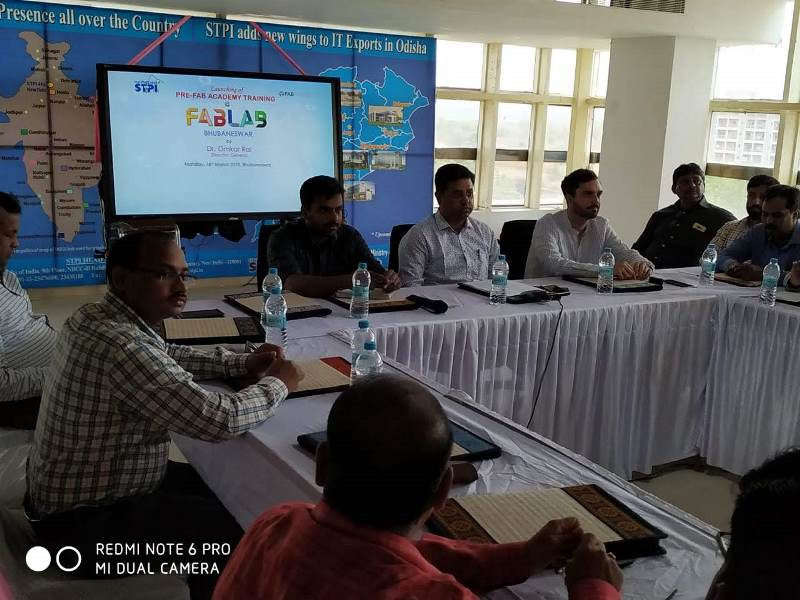

# Documentation
## 18.03.2019 Time 14:45 Hrs. Session 1 Pre Fab Training

Today was the firs day of 3 weeks Pre-Fab Training Programs at STPI-Bhubaneswar.
### We have a very friendly mentors with us :
1. Mr. Francisco 
2. Mr. Shibu

Today we had a tour to the Fab lab located at 2nd Floor of our office premises.
During our visit to lab we visited and saw different equipment's available in the lab.
Equipment's we saw in the Lab are as follows:
1. **3 Axis CnC Shopbot Machine** with a resolution of 1/10th of 1mm. The CnC machine is of size 96X48. This machine needs lot of attention during operation with minute carelessness it may cause an accident. This machine cause lost of dusts and also noise so we need safety have all safety measures in place while entering into the room.
2. **Band Saw Machine** is there for simple cutting.
3. **Scroll Saw Machine** also use for cuttings.
4. **Roland Vinyl Cutter** is used for cutting and preparing vinyl stickers, also we can use the same machine for drawing purpose with little modification by place a pencil in place of blade. The blade edge is very sharp and we have to fix it as per the thickness of the material so that only the upper sheet gets cut not the base layer. It has x axis and Y axis. The maximum force of the cutter is 85 grams.
5. **3D printer with Fused Filament Depositor** This one the basic 3D printer which uses a PLA filament for creating 3D objects. The technique used in this printer is creating an object by diffusing the filament. This printer is mono-color printer.
6.**Liquid Resin Stereo Lithographic Printer**  This is another kind of 3D printer with different technology. It uses liquid resin and ultra violet rays for creating an objects.
7. **Stratys Color Inkjet 3D Printer** This is the latest 3D technology printer which can print 3D objects in full color.
8. **Laser Cutter Machine** This machine is again very sophisticated machine used for cutting natural items such as wood, paper, leather. The lenses are very sophisticated and expensive and sometimes it catches fire too if not used properly. This machine creates smokes with some gases while cutting so we have a air filter attached with the machine which has 3 stage filtration with HEPA in middle and Activated Carbon in the top to absorb all the gases. 
9. **Milling Machine** This machine is also known as mini CnC machine. This is used for printing PCB boards, and for high resoulution objects as smaller objects.
Not able to concerntrate anymore due to headache and cold, with permission from the captain Mr Franc i am going back to hotel for rest.
## 21.03.2019 Time 11:15 Hrs. 
Back to job feeling bit better after the medication. Missed 1.5 day session due to bad health. will be printing my name first by using inkscape application and then will create the vinyl sticker by using Vinyl Cutter.
Inkscape under File section in the document properties first we have to set area as Custom size let's say 150 mm wide by 50 mm height. Now select a bold font from the font menu and add text let's say my name as " Samrat" in Black&White only. Now save the file in .svg in the repository and export in png format with 600 dpi for vinyl cutter.