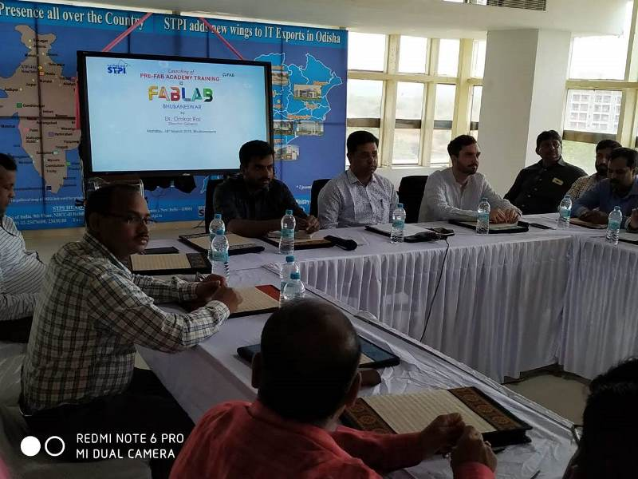
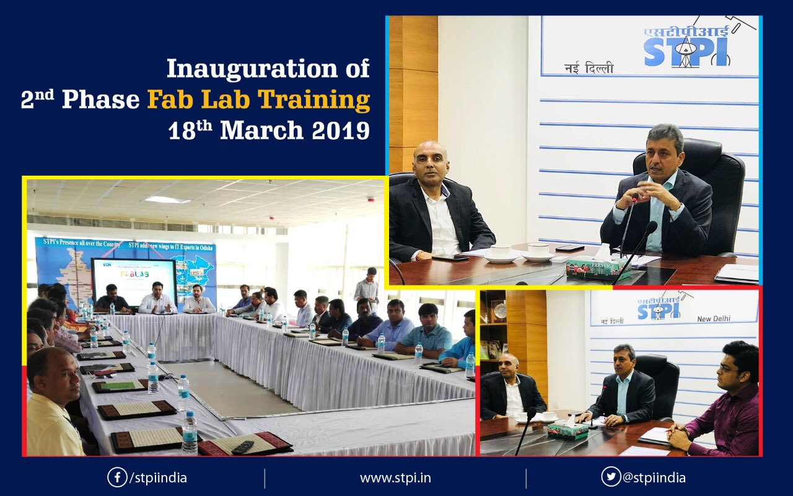

# Introduction
Welcome to **STPI-Bhubaneswar Fabzero Programme**. The training program is a _3 weeks programme_ where we will be learning about operations of different equipment's available at the Lab and also the safety measures to be adopted while accessing the machines.A Fab lab is equipped with an array of computer controlled machines that help us to get a prototypes of our ideas we you can make almost anything by using the fab lab facilities. Fabzero is a 3 weeks training aims to help us to get a hands on experience in all the fab lab machines as well as it will introduce us to electronic circuit production and low level programming. Myself **Samrat Chakraborty**, Technical Officer posted at **STPI-Patna**. I am a _MCA graduate from SASTRA Universities_.

The inaugural session of three weeks training programme kick started with the inaugural speech from "**Dr. Omkar Rai**", _Director General- STPI_ via Video conferencing where our DG addressed all the participants. Followed by by DG address we had a introduction session where all participants introduced themselves.

**We were very fortunate that we have a very friendly and Knowledgeable mentors with us :**
1. Mr. Francisco Sanchez 
2. Mr. Sibu Saman