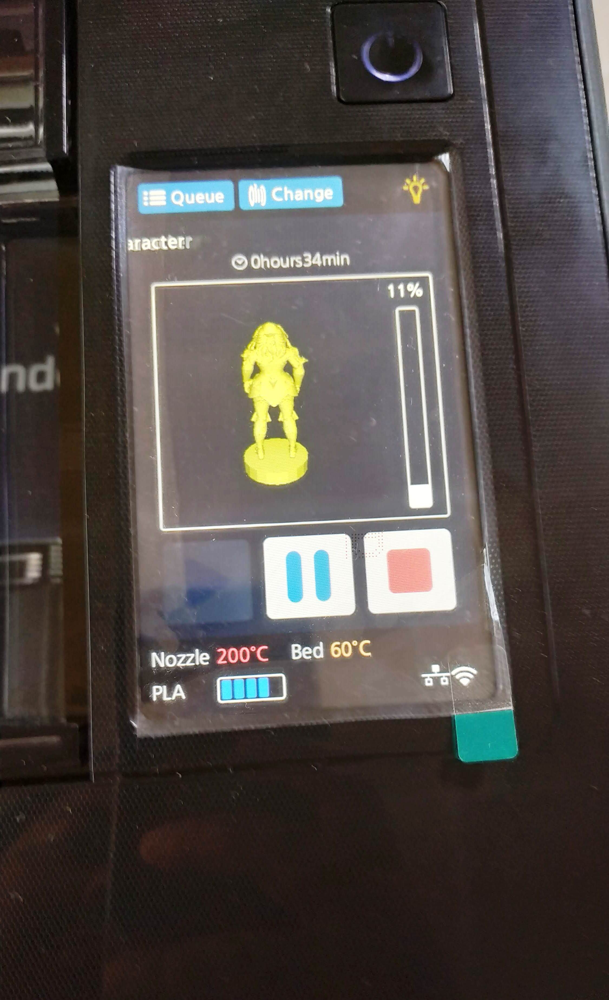
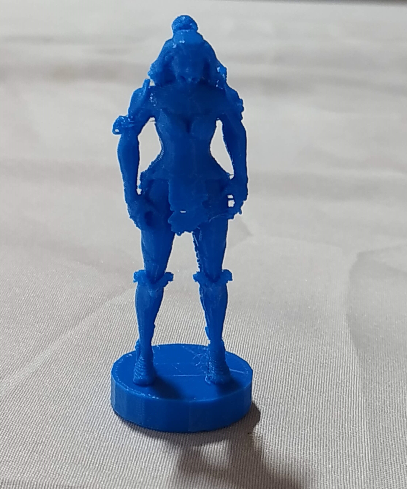
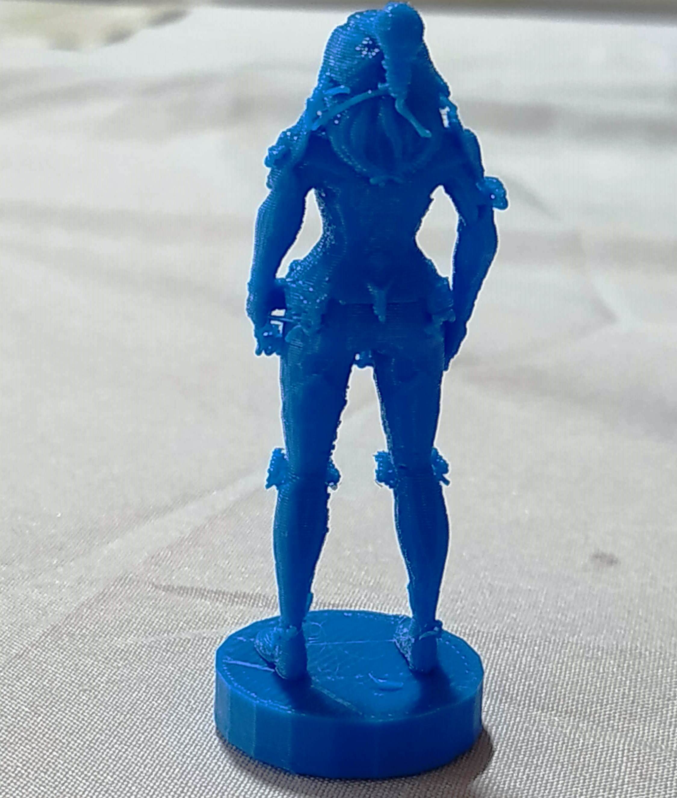

# My first 3D object using with Fused Filament Depositor technology (Sindoh 3D Printer) 
## Prerequisites:

**3D Image File**

**3D Printer with Filament**

**3D WOX Application** 

For any 3D printing we should a have 3D object which need to be printed. We can download a 3D image from website or we can create our own 3D model through **FreeCad** software. I download an image from internet for printing in 3D printer.

To print the above image, i need an application called"_**3D WOX Application**_". In 3D WOX Application we need to load the image and then we need to load the "_**G Code**_" of the model. In my case the model is "_**Chess_Piece_Queen_Fortnite_Valor_character.stl**_". The extension of the file will be **.stl** which **stereolithography**.

The Sindoh printer can be used as Network Printer as well as we can print our 3D object by directly from USB device. This printer prints in mono color.

From **3D WOX Application** i have given print command by selecting the printer available on my network. Once we give print command the 3D file can be seen in the display of the **3D Sindoh Printer**.

**3D Sindoh Printer** on job of printing the model.

It took almost 40 minute for me to get the object printed.

The final output after printing.

 