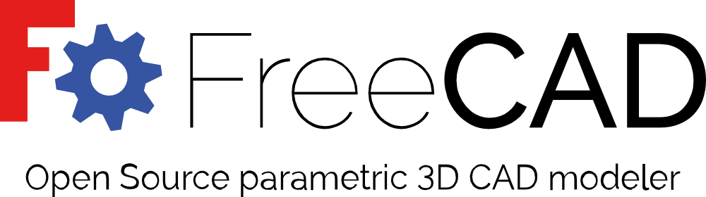
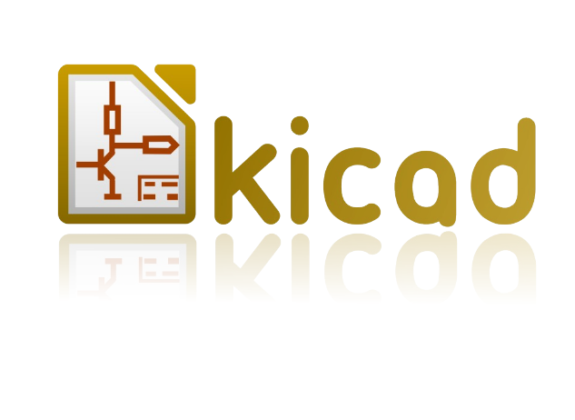

# Designing Application/ Tools 

We have to download all the below mentiobed softwares and be familiarized with them in order to successfully complete the Fabzero programme.
## For 3D Design :
* [FreeCad](#FreeCad)
* [Cura](#Cura)
## For 2D Design :
* [Gimp](#Gimp)
* [Inkscape](#Inkscape)
## For Electronic Design :
* [KiCad](#Kicad)
## Other:
* [Visual Studio Code](#VisualStudioCode)

<a name="FreeCad">         **FreeCad**</a> is a general purpose feature-based, parametric 3D modeler for CAD, MCAD, CAx, CAE and PLM, aimed directly at mechanical engineering and product design but also fits a wider range of uses in engineering, such as architecture or other engineering specialties. It is 100% Open Source and extremely modular, allowing for very advanced extension and customization.

<a name="Cura">        **Cura**</a>  is used for 3D printing. Cura creates a seamless integration between your 3D printer, software and materials to achieve perfect prints every time. 3 steps to printing a 3D model design prepare and print.

<a name="Gimp">        **Gimp**</a> GIMP is a cross-platform image editor available for GNU/Linux, OS X, Windows and more operating systems. It is free software, and we can change its source code and distribute our changes. We can further enhance our productivity with GIMP thanks to many customization options and 3rd party plugins.

<a name="Inkscape">        **Inkscape**</a> is quality vector graphics software which runs on Windows, Mac OS and Linux operating system. It is used to design a wide variety of graphics such as icons, logos, diagrams. Inkscape uses the W3C open standard SVG (Scalable Vector Graphics) and is free and open-source software.  

<a name="Kicad">        **KiCad** </a> is a free software used for electronic design automation. It facilitates the design of schematics for electronic circuits and their conversion to PCB designs. It features an integrated environment for schematic capture and PCB layout design.

<a name="Kicad">        **KiCad** </a><a name="VisualStudioCode"> **Visual Studio Code** </a>  is a source-code editor developed by Microsoft for Windows, Linux and macOS. It includes support for debugging, embedded Git control, syntax highlighting, intelligent code completion, snippets, and code refactoring.