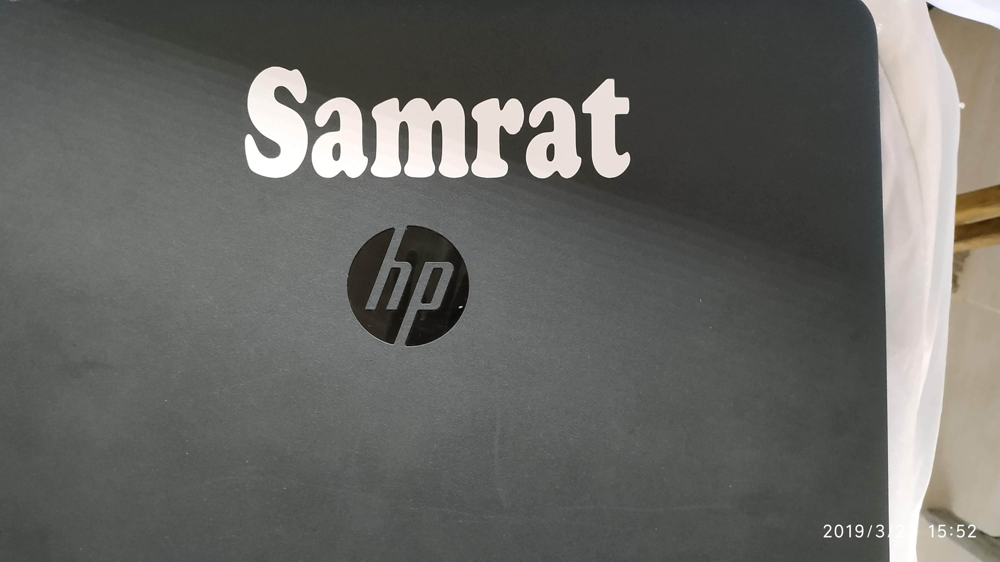

## Roland Vinyl Cutter

To start preparing a a vinyl sticker with **Roland Vinyl Cutter** we need to first create our design in **Inkscape**.

Francisco told us about the functioning of the Vinyl Cutter and cut out a sample design using the fab modules software on linux box. He then asked us to design our name to practice operating the machine.

We have been given assignment of printing vinyl sticker of our own names. The size of the sticker should be **150 mm wide by 50 mm height**. In Inkscape under the _File_ section we have to navigate to _Document Properties_ we have to set area as custom with size as "_150 mm wide by 50 mm height_". Now we need to select a **Bold Font** from the font menu and add text let's say my name as "**Samrat**" in Black&White only. Now save the file in **.svg** in the repository and export in png format with **600 dpi** for vinyl cutter.

After opening fab modules, click on image(png) as input and **Roland vinyl Cutter (.camm)** as output. Then click on **make_png_camm** button.
Now it is ready for printing. By using **LPR** command we will send for printing the sticker. Before sending for printing we need to load desired color _Vinyl Roll_, we need to check the blade position and then set the _Origin_ in the machine. 

**_Note_:** It is advisable to check the blade position whenever we change the vinyl roll because different vinyl roll may different thickness.